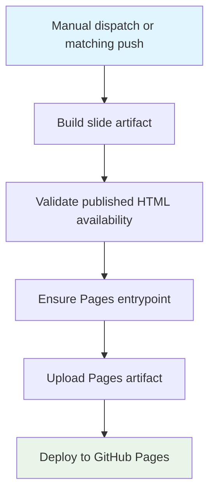

## Workflow Overview

**Purpose**: Publish the course slide experience to GitHub Pages from the repository's Basics and Advanced slide trees.
**Trigger Events**:
- Manual workflow dispatch
- Push to `main` when configured slide-publishing paths change
**Target Environments**:
- GitHub-hosted Linux runner for build and deployment
- `github-pages` environment for final publication

## Execution Flow Diagram



## Jobs & Dependencies

| Job Name | Purpose | Dependencies | Execution Context |
|----------|---------|--------------|-------------------|
| build | Produce the Pages-ready `_site` artifact from Basics and Advanced slide content | Matching trigger event | GitHub-hosted Linux runner |
| deploy | Publish the prepared artifact to GitHub Pages | `build` | GitHub-hosted Linux runner + `github-pages` environment |

## Requirements Matrix

### Functional Requirements

| ID | Requirement | Priority | Acceptance Criteria |
|----|-------------|----------|-------------------|
| REQ-001 | The workflow shall support both manual runs and automatic publish runs from repository changes. | High | A maintainer can trigger a publish manually, and matching pushes to `main` start the workflow automatically. |
| REQ-002 | The build job shall publish Basics and Advanced slide outputs as separate module trees. | High | The Pages artifact contains both `slides/basics/` and `slides/advanced/` when content is available. |
| REQ-003 | The workflow shall preserve a usable published landing experience even when generated module output lacks a usable HTML entrypoint. | High | The final Pages artifact includes a working root entrypoint that resolves to published slide content. |
| REQ-004 | The workflow shall permit checked-in standalone slide trees to serve as fallback publish content. | High | When generated HTML is unavailable for a module, the final artifact still contains that module's checked-in standalone slide site. |
| REQ-005 | The workflow shall package a single Pages artifact and deploy it through a separate deployment step. | High | Publish output is staged before deployment and released through the Pages environment. |
| REQ-006 | The workflow shall avoid exposing top-level README artifacts as published slide entrypoints. | Medium | The published module roots do not surface README files as the main landing content. |

### Security Requirements

| ID | Requirement | Implementation Constraint |
|----|-------------|---------------------------|
| SEC-001 | Deployment permissions shall be scoped to the workflow jobs that require them. | Only the build and deploy jobs receive the elevated repository and Pages permissions required for publication. |
| SEC-002 | Third-party automation dependencies shall be pinned and reviewed deliberately. | Action updates must preserve pinned references and be reviewed alongside runtime compatibility changes. |
| SEC-003 | Redirect and entrypoint generation shall avoid unsafe published paths. | Any generated root landing page must target only validated internal slide paths. |

### Performance Requirements

| ID | Metric | Target | Measurement Method |
|----|-------|--------|-------------------|
| PERF-001 | Publish freshness | Latest matching push wins | Concurrency settings cancel superseded in-progress Pages runs. |
| PERF-002 | Artifact completeness | Both module slide trees present whenever module content exists | Inspect the uploaded Pages artifact for Basics and Advanced outputs. |

## Input/Output Contracts

### Inputs

```yaml
repository_triggers:
  branches: [main]
  paths:
    - Basics/lessons/slides/**
    - Advanced/lessons/slides/**
    - .marprc.yml
    - .github/workflows/marp-action.yml
    - _site/slides/**
manual_trigger:
  workflow_dispatch: true
content_sources:
  basics_source: Basics/lessons/slides
  advanced_source: Advanced/lessons/slides
```

### Outputs

```yaml
pages_artifact:
  root_entrypoint: _site/index.html
  basics_module_tree: _site/slides/basics/**
  advanced_module_tree: _site/slides/advanced/**
deployment:
  environment: github-pages
```

### Secrets & Variables

| Type | Name | Purpose | Scope |
|------|------|---------|-------|
| Variable | JavaScript action runtime override | Temporary compatibility override for referenced JavaScript-based actions | Workflow |
| Environment | GitHub Pages environment metadata | Associates deployment output with the published Pages site | Deployment job |

## Execution Constraints

### Runtime Constraints

- **Concurrency**: All runs share a single Pages publish group; newer runs cancel older in-progress runs.
- **Artifact shape**: Publish output must be staged under `_site/` before deployment.
- **Job order**: Deployment does not begin until the build artifact is prepared successfully.

### Environmental Constraints

- **Runner Requirements**: Linux runner capable of building slide assets and publishing a Pages artifact
- **Network Access**: Required for action execution and GitHub Pages deployment
- **Permissions**: Build and deploy require repository-content and Pages publication permissions plus OpenID Connect support for Pages deployment

## Error Handling Strategy

| Error Type | Response | Recovery Action |
|------------|----------|-----------------|
| Missing generated module HTML | Fall back to checked-in standalone slide trees | Copy the module's checked-in slide site into the Pages artifact and continue |
| Missing fallback slide content | Fail the build | Restore the missing checked-in slide tree or fix build generation so the module produces HTML |
| Missing root entrypoint | Generate or copy a safe root entrypoint | Publish a validated redirect or static landing page into `_site/index.html` |
| Deployment failure | Stop publish completion | Re-run the workflow after resolving Pages or permission issues |

## Quality Gates

### Gate Definitions

| Gate | Criteria | Bypass Conditions |
|------|----------|-------------------|
| Module output availability | Each module must contribute usable HTML or an approved fallback tree | None |
| Safe root entrypoint | The final artifact must include a valid root landing page | None |
| Artifact upload | `_site/` must be packaged successfully before deploy begins | None |

## Monitoring & Observability

### Key Metrics

- **Success Rate**: Publishing runs complete without fallback failure
- **Execution Time**: Build and deploy finish quickly enough that manual re-runs remain practical
- **Fallback Frequency**: Maintainers should watch for repeated fallback copy behavior because it signals build-output drift

### Alerting

| Condition | Severity | Notification Target |
|-----------|----------|-------------------|
| Build cannot produce or recover a usable module tree | High | Repository maintainers |
| Deploy job cannot publish the Pages artifact | High | Repository maintainers |
| Trigger/config drift causes expected changes not to publish | Medium | Repository maintainers |

## Integration Points

### External Systems

| System | Integration Type | Data Exchange | SLA Requirements |
|--------|------------------|---------------|------------------|
| GitHub Pages | Deployment target | Uploaded static site artifact | Published site should remain reachable after successful runs |
| GitHub Actions artifact system | Build-to-deploy handoff | `_site/` Pages artifact | Artifact must remain intact between jobs |

### Dependent Workflows

| Workflow | Relationship | Trigger Mechanism |
|----------|--------------|-------------------|
| None directly | Independent publish workflow | N/A |

## Compliance & Governance

### Audit Requirements

- **Execution Logs**: Retain workflow logs through GitHub Actions history
- **Approval Gates**: Changes to workflow logic should be reviewed as infrastructure changes
- **Change Control**: Update this specification and `README.md` before or with workflow behavior changes

### Security Controls

- **Access Control**: Limit workflow updates to trusted maintainers
- **Secret Management**: Prefer platform-provided deployment credentials and environment metadata over custom secrets
- **Vulnerability Scanning**: Review pinned action updates and runtime compatibility changes together

## Edge Cases & Exceptions

### Scenario Matrix

| Scenario | Expected Behavior | Validation Method |
|----------|-------------------|-------------------|
| Basics generated output is missing HTML | Publish uses the checked-in Basics standalone slide tree | Inspect `_site/slides/basics/` in the artifact |
| Advanced generated output is missing HTML | Publish uses the checked-in Advanced standalone slide tree | Inspect `_site/slides/advanced/` in the artifact |
| No generated root landing page exists | Workflow creates or copies a valid `_site/index.html` entrypoint | Open the published site root and confirm it resolves to slide content |
| A lecture-script-only change lands under `lessons/lecture/` | No slide publish run is triggered by path filters alone | Review trigger configuration and workflow history |
| Advanced config changes outside watched paths | Publish may not run automatically | Confirm trigger coverage whenever config files change |

## Validation Criteria

### Workflow Validation

- **VLD-001**: A successful run publishes a root Pages landing page plus both module slide trees
- **VLD-002**: Manual dispatch can republish the site without requiring a content change
- **VLD-003**: If generated module HTML is unavailable, fallback content preserves a usable published site
- **VLD-004**: Changes to the workflow or watched slide paths trigger publication automatically on `main`

### Performance Benchmarks

- **PERF-001**: Concurrency prevents obsolete in-progress publish runs from completing after newer runs begin
- **PERF-002**: The artifact remains deployable even when one or both modules require fallback content

## Change Management

### Update Process

1. **Specification Update**: Update this document and the README workflow notes first
2. **Review & Approval**: Review trigger coverage, fallback behavior, and root entrypoint handling together
3. **Implementation**: Apply workflow changes in `.github/workflows/marp-action.yml`
4. **Testing**: Validate with a manual workflow dispatch and inspect the resulting Pages artifact
5. **Deployment**: Merge and monitor the next publish run

### Version History

| Version | Date | Changes | Author |
|---------|------|---------|--------|
| 1.0 | 2026-05-15 | Initial specification for the slide publishing workflow | Copilot |

## Related Specifications

- [`../README.md`](../README.md)
- [`spec-process-project-completion.md`](spec-process-project-completion.md)
- [`../.github/workflows/marp-action.yml`](../.github/workflows/marp-action.yml)
